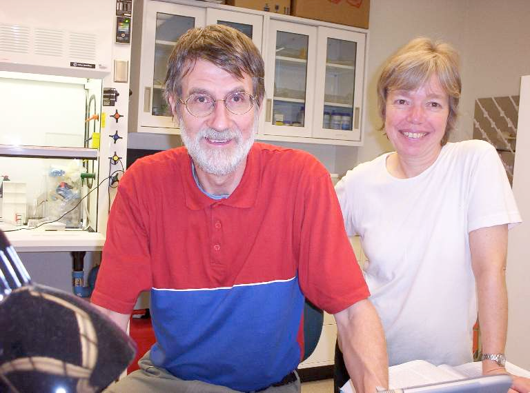

# Contributing – 4D Viewer

Dieses Projekt wird gemeinschaftlich entwickelt, getestet und genutzt. Ein herzlicher Dank geht an alle, die zur
Verbesserung, Erweiterung und Pflege des 4D Viewers beigetragen haben.

## 👥 Gesamtübersicht

| Name                          | Kategorie             | Rolle / Beitrag                                | Version(en) | Datum                  |
|-------------------------------|-----------------------|------------------------------------------------|-------------|------------------------|
| **Einhard Schierenberg**      | 1️⃣ Erstentwickler    | Ideengeber                                     | v1.0 - v1.2 | Unbekannt – 02.03.2017 |
| **Sascha Zur**                | 1️⃣ Erstentwickler    | Erstentwicklung der App                        | v1.0 - v1.2 | Unbekannt – 02.03.2017 |
| **Oliver Kaiser**             | 💻 Entwickler         | Hauptentwickler                                | v2.0 – v2.1 | 24.08.2023 – Heute     |
| **Lion Rexhepi**              | 💻 Entwickler         | Mitentwickler                                  | v2.1        | 06.10.2025 – Heute     |
| **Peter Heger**               | 🧬 Mitwirkende Person | Ausbilder für MATSE an der Universität zu Köln | v2.0 – v2.1 | 28.09.2023 – Heute     |
| **Olaf Bossinger**            | 🧬 Mitwirkende Person | Nutzer & UX-Feedback                           | v2.0 – v2.1 | 28.09.2023 – Heute     |
| **Julia Camps**               | 🧬 Mitwirkende Person | Nutzerin & UX-Feedback                         | v2.0 – v2.1 | 28.09.2023 – Heute     |
| **Jiyu (Graduate-Studentin)** | 🧬 Mitwirkende Person | Bereitstellung biologischer 4D-Datensätze      | v2.0 – v2.1 | 28.09.2023 – Heute     |

## ℹ️ Hinweise

- **Einhard Schierenberg** entwickelte die grundlegende Idee des 4D Viewers.
- **Sascha Zur** erstellte die erste lauffähige Version, welche später als Grundlage für die _Entwicklung der
  Versionsreihe 2.*_ diente.
- Ab `Version 2.0` unterstützten **Olaf Bossinger** und **Peter Heger** das Projekt in beratenden Rollen:
    - **Peter Heger** als Ausbilder für MATSE (Mathematisch-Technischer Softwareentwickler) mit fachlicher Betreuung.
    - **Olaf Bossinger** als wichtiger Ansprechpartner für **Oliver Kaiser**, sowohl in UX-Fragen als auch im täglichen
      Austausch. Er lieferte kontinuierlich wertvolles Nutzerfeedback, prägte viele praktische Verbesserungen und stand
      als direkte Bezugsperson stets zur Seite.
- **Oliver Kaiser** übernahm die leitende Weiterentwicklung der `Version 2.*`.
- **Lion Rexhepi** brachte ab `Version 2.1` wesentliche Beiträge zur modularen Code-Architektur und zur Implementierung
  neuer Funktionen ein.

## 🙏 Dank

Ein großes Dankeschön an **alle Entwickler, Tester und Nutzer**, die den 4D Viewer mit Engagement und Feedback
unterstützen!

> **_Olaf Bossinger an Oliver Kaiser:_**\
> „Ich glaube, das Projekt macht dir genauso viel Spaß wie mir – und wir sind auf dem richtigen Weg.“

**Postum:** In Gedenken an Einhard Schierenberg (1948–2022). Seine ursprüngliche Vision legte den Grundstein
für den 4D Viewer. Ohne seinen Impuls würde es dieses Projekt in seiner heutigen Form nicht geben.

Abgerufen
von: [College of Natural & Agricultural Sciences | UC Riverside](https://faculty.ucr.edu/~pdeley/lab/visitors/schierbio.html)
