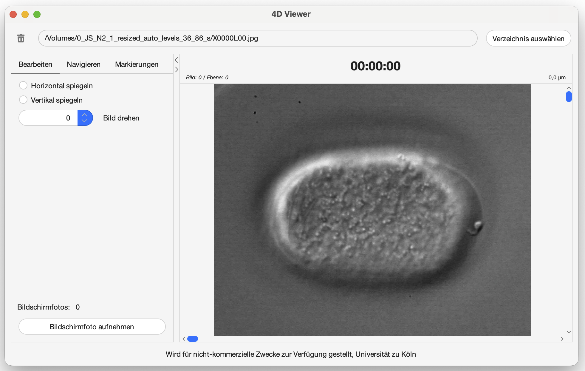
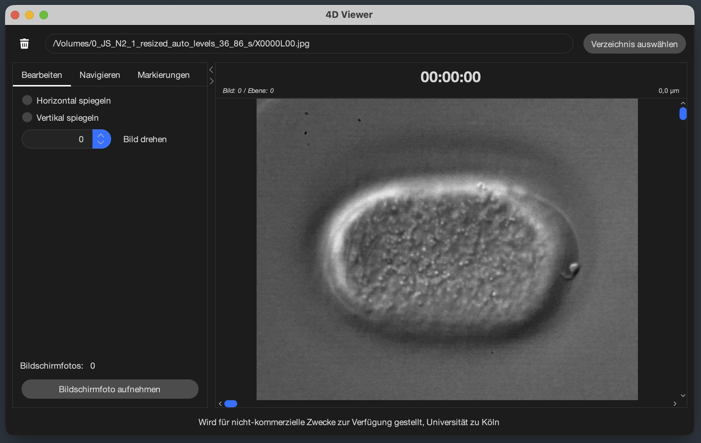

# 4D_Viewer

Ein leistungsstarkes, intuitives und erweiterbares Tool zur **Visualisierung, Analyse und Bearbeitung von vierdimensionalen Bilddaten**.
Entwickelt in **Java**, speziell für **mikroskopische und biologische Anwendungen** (z. B. Embryonenanalyse), bietet der 4D Viewer eine moderne Oberfläche und flexible Bildmanipulation.

## 🚀 Funktionsübersicht

- **Visualisierung von 4D-Bilddaten**: (3D-Raum + Zeit) mit flüssiger Navigation
- **Interaktive Steuerung**: Maus und Tastatur mit Shortcuts
- **Bildbearbeitung**: 
  - Horizontale/Vertikale Spiegelung
  - Rotation
- **Markierungen**:
  - Formen: Ellipse und Rechteck
  - Farbe, Größe und Position sind frei wählbar
  - Automatisches Laden/Speichern von Markierungen
- **Unterstützte Formate**: GIF, JPEG, PNG, TIFF
- **Internationalisierung**: Deutsch/Englisch
- **Projektdaten**:\
  Verzeichnis → {Benutzerverzeichnis}/.4D_Viewer/{Bilderverzeichnis}
    - *config.json*: projektbezogene Konfigurationen (Dateityp, Zeit-/Ebenen-Trenner, Zeit-/Ebenen-Einheit,
      Bildspiegelung X/Y, Bildrotation)
    - *markers.json*: projektbezogene Markierungen aus der UI
    - *snapshots/ (Ordner)*: Ablage für erzeugte Momentaufnahmen

- **Einstellungen**:\
  Verzeichnis → {Benutzerverzeichnis}/.4D_Viewer/
    - *history.txt*: Liste der zuletzt verwendeten Bildverzeichnisse
    - *settings.json*: Benutzereinstellungen (Sprache, Theme, Schriftgröße, Shortcuts)

## 📸 Screenshots

### Helles Farbschema

Das helle Farbschema bietet eine klare, freundliche und kontrastreiche Oberfläche. Ideal für gut beleuchtete Arbeitsumgebungen oder Nutzer, die eine klassische, helle Darstellung bevorzugen.



### Dunkles Farbschema

Das dunkle Farbschema sorgt für eine angenehme Darstellung bei geringer Umgebungshelligkeit. Es schafft eine moderne, elegante Atmosphäre.



### Einstellungen

Im Einstellungsfenster lassen sich Anzeigeoptionen anpassen. Hier können individuelle Präferenzen festgelegt werden – etwa die Sprache, das Farbschema, die Schriftgröße …


**[Weitere Demo-GIFs, Screenshots und Beispiele hinzufügen]**

## 📂 Projektstruktur
4d_viewer/\
├── *images/* – Ablage für Test-Bilder\
├── *src/* – Source-Code des Projekts\
├── *pom.xml* – Maven Build-Konfiguration\
├── *README.md* – Projektdokumentation\
└── *.gitignore* – Git Ignore-Regeln

## 🧩 Installation & Ausführung
1. **Repository klonen**

    Die Anwendung kann aus dem GitLab-Repository heruntergeladen werden. Anschließend ins Projektverzeichnis wechseln:
    ```bash
    git clone https://gitlab.git.nrw/okaiser1/4d_viewer.git
    cd 4d_viewer
    ```

2. **Abhängigkeiten installieren & Build erstellen**

    Die Anwendung wird mit Maven verwaltet. Der folgende Befehl installiert alle benötigten Abhängigkeiten, bereinigt alte Builds und erzeugt anschließend eine ausführbare JAR-Datei im Ordner `target/`:
    ```bash
    mvn clean install && rm target/original-*.jar
    ```

3. **Anwendung starten**

    Die Anwendung kann entweder direkt über Maven ausgeführt oder über die erzeugte JAR-Datei gestartet werden:<br><br>
    **Option A: Direkt über Maven**
    ```bash
    mvn exec:java
    ```
    
    **Option B: Über die JAR-Datei**
    ```bash
    java -jar target/*.jar
    ```

## ⚙️ Nützliche Hinweise & Troubleshooting

### Java-Version prüfen

- Stellen Sie sicher, dass Java 20 korrekt installiert ist. Die Ausgabe sollte entsprechend lauten:
    ```bash
    java -version
    ```

- Beispielsausgabe:
    ```bash
    openjdk version "20.0.2" 2023-06-14
    ```

Falls eine andere Version angezeigt wird, muss ggf. das JAVA_HOME angepasst oder eine passende JDK-Version installiert werden.

### Wichtige Maven-Befehle

| Befehl                    | Zweck                              |
|---------------------------|------------------------------------|
| `mvn clean install`       | Projekt bereinigen und neu bauen   |
| `mvn compile`             | Kompilieren des Projekts   	       |
| `mvn dependency:resolve`  | Nur Abhängigkeiten aktualisieren   |
| `mvn test`                | Tests ausführen	                   |

### Hinweise für IntelliJ IDEA

1. Öffne das Projektverzeichnis (4d_viewer) in IntelliJ.\
   (Alternativ: `Project Structure...`)
2. Wähle als Project SDK: JDK 20
3. IntelliJ erkennt automatisch das Maven-Projekt und lädt alle Abhängigkeiten.
4. Zum Starten:
   - Wähle im Menü Run → Run 'Main' oder
   - Erstelle eine Run-Konfiguration mit dem Main-Class-Pfad (z. B. de.uzk.Main).

## 🔧 Entwicklung

### Technologien

- IDE: IntelliJ IDEA (Community / Ultimate)
- Sprache: Java 20 (OpenJDK)
- Build-Tool: Apache Maven 3.9.11

### Abhängigkeiten (Auszug)
| Bibliothek                                       | Version | Zweck / Beschreibung                                         |
|--------------------------------------------------|---------|--------------------------------------------------------------|
| com.fasterxml.jackson.core:jackson-annotations   | 2.20    | Annotationen zur Steuerung von JSON-(De-)Serialisierung      |
| tools.jackson.core:jackson-core                  | 3.0.1   | JSON Parser/Generator                                        |
| tools.jackson.core:jackson-databinding           | 3.0.1   | ObjectMapper für POJO ↔ JSON (inkl. Serializer/Deserializer) |
| com.formdev:flatlaf                              | 3.6     | Modernes Look & Feel für Swing                               |
| com.formdev:flatlaf-extras                       | 3.6     | Erweiterungen für FlatLaf                                    |
| org.jetbrains:annotations                        | 26.0.2  | Annotationen für statische Analysen                          |
| org.junit.jupiter:junit-jupiter                  | 6.0.0   | Test-Framework (JUnit 5)                                     |

## 🗺️ Roadmap

### Version 2.0

- [x] **Umstieg auf FlatLaf** – neues, modernes Erscheinungsbild
- [x] **Bildbearbeitung erweitert** – Funktionen für Spiegelung und Rotation hinzugefügt
- [x] **Optimierung der Ladezeit** und des Ladedialogs für Bilder
- [x] **Menüleiste** integriert
- [x] **Tastenkombinationen (Shortcuts)** hinzugefügt

### Version 2.1

- [x] **Internationalisierung** (Deutsch / Englisch) implementiert
- [x] **Code modularisiert** zur besseren Wartbarkeit und Erweiterbarkeit
- [x] **Markierungsfunktion** ergänzt
- [x] **Einstellungsverwaltung** hinzugefügt (Einstellungen werden im Appverzeichnis abgespeichert)
- [x] **Automatische Projektspeicherungen** hinzugefügt (Konfigurationen & Markierungen werden in Projektverzeichnissen abgespeichert)
- [x] **UI-Design überarbeitet** – Komponenten jetzt mit abgerundeten Ecken

### Neue Funktionen in Arbeit

- [ ] Reiter „Bearbeiten“ erweitert um:
    - [ ] Helligkeits- und Kontrastregler
    - [ ] Zoom- und Zuschneidefunktion (Crop)
- [ ] Reiter „Navigieren“ um neue Navigations-Features ergänzen

## 📊 Projektstatus

Das Projekt befindet sich aktuell in **aktiver Entwicklung**.
Ziel ist es, eine stabile, nutzerfreundliche und erweiterbare Plattform zur 4D-Visualisierung zu schaffen.

## 🤝 Beitragende

Ein großes Dankeschön an alle Entwickler, Tester und Nutzer, die dieses Projekt mitgestalten!
>„Ich glaube, das Projekt macht dir genauso viel Spaß wie mir – und wir sind auf dem richtigen Weg.“\
> ~ Olaf Bossinger

## 🔐 Lizenz

Dieses Projekt ist unter der **[Lizenzname hinzufügen]** lizenziert. \
Details siehe [Lizenzdate](LINK-ZUR-LIZENZ) **[Link hinzufügen]**